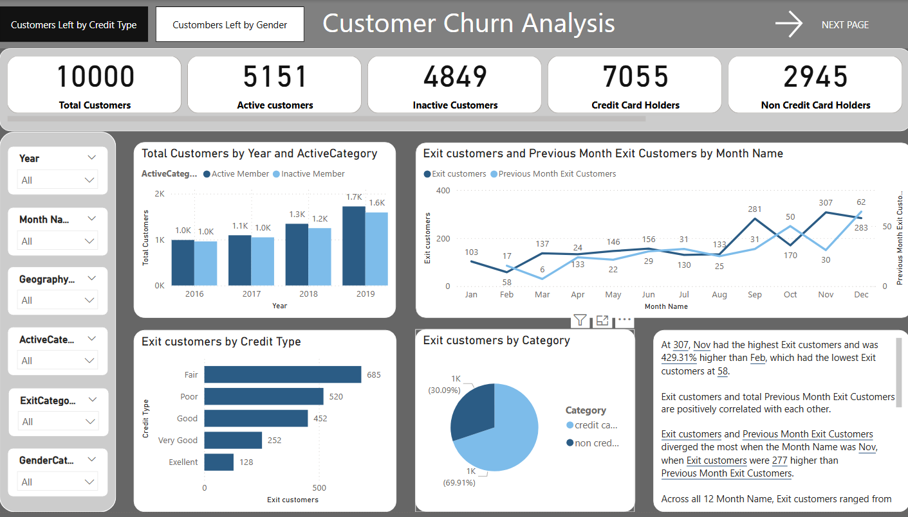

# 🏦 Banking Domain Dashboard — Customer Churn Analysis | Power BI

An interactive multi-page Power BI dashboard analyzing customer churn patterns across 10,000 bank customers — tracking active vs inactive members, credit card usage, exit trends by month, and churn by geography, gender, and credit type.

---

## 📸 Dashboard Preview



---

## 🎯 Project Overview

This dashboard helps banking analysts and business managers identify at-risk customers and understand churn drivers. Built on a real-world bank churn dataset with 7 linked data tables, it provides actionable insights into customer retention across multiple dimensions.

---

## 📈 Key Metrics at a Glance

| Metric | Value |
|---|---|
| Total Customers | **10,000** |
| Active Customers | **5,151** |
| Inactive Customers | **4,849** |
| Credit Card Holders | **7,055** |
| Non Credit Card Holders | **2,945** |

---

## ✨ Dashboard Features

- 📅 **Yearly Trend** — Total customers by year (2016–2019) split by Active/Inactive members
- 📈 **Monthly Exit Trend** — Exit customers vs Previous Month Exit Customers line chart across all 12 months
- 💳 **Exit by Credit Type** — Horizontal bar chart (Fair: 685, Poor: 520, Good: 452, Very Good: 252, Excellent: 128)
- 🥧 **Exit by Category** — Pie chart: Credit card (69.91%) vs Non-credit card (30.09%) churners
- 📊 **Smart Narrative** — Auto-generated insight box highlighting Nov as peak churn month (307 exits, 429.31% higher than Feb)
- 🔍 **Interactive Filters** — Year, Month, Geography, ActiveCategory, ExitCategory, GenderCategory slicers
- 📑 **Multi-page** — "Customers Left by Credit Type" and "Customers Left by Gender" tabs

---

## 🗂️ Data Model

This dashboard uses a **star schema** with 7 linked tables:

| Table | Type | Description |
|---|---|---|
| `Bank_Churn` | Fact | Main churn dataset with customer records |
| `CustomerInfo` | Dimension | Customer demographics and account details |
| `ActiveCustomer` | Dimension | Active/Inactive member lookup |
| `CreditCard` | Dimension | Credit card holder status |
| `ExitCustomer` | Dimension | Exit/retain customer lookup |
| `Gender` | Dimension | Gender lookup table |
| `Geography` | Dimension | Country/region lookup table |

---

## 🔑 Key DAX Measures

```dax
-- Total Customers
Total Customers = COUNT(Bank_Churn[CustomerId])

-- Active Customers
Active customers = 
CALCULATE(COUNT(Bank_Churn[CustomerId]), 
    ActiveCustomer[ActiveCategory] = "Active Member")

-- Inactive Customers
Inactive Custo... = 
CALCULATE(COUNT(Bank_Churn[CustomerId]), 
    ActiveCustomer[ActiveCategory] = "Inactive Member")

-- Exit Customers
Exit customers = 
CALCULATE([Total Customers], ExitCustomer[ExitCategory] = "Exit Customers")

-- Previous Month Exit Customers
Previous Month... = 
CALCULATE([Exit customers], PREVIOUSMONTH(DateMaster[Date]))

-- Churn %
Churn % = DIVIDE([Exit customers], [Total Customers], 0) * 100

-- Credit Card Holders
Credit Card Hol... = 
CALCULATE([Total Customers], CreditCard[Category] = "credit card holder")

-- Non Credit Card Holders
Non Credit Car... = 
CALCULATE([Total Customers], CreditCard[Category] = "non credit card holder")

-- Retain Customers
Retain customers = 
CALCULATE([Total Customers], ExitCustomer[ExitCategory] = "Retain Customers")
```

---

## 💡 Key Insights

- 📅 **November** had the highest exit customers at **307** — 429.31% higher than February (lowest at 58)
- 💳 Customers with **Fair credit** churn the most (685), suggesting credit health is a key retention factor
- 📊 **69.91%** of churned customers were credit card holders — a critical segment to focus retention efforts on
- 📈 Total customers grew steadily from ~2K in 2016 to ~3.3K in 2019, but inactive members also rose proportionally
- 🔗 Exit customers and Previous Month Exit Customers are **positively correlated** — churn clusters in waves

---

## 📁 Repository Structure

```
banking-dashboard-powerbi/
│
├── Banking_Domain.pbix          # Main Power BI report
├── data/
│   ├── Bank_Churn.csv           # Main fact table
│   ├── CustomerInfo.csv         # Customer demographics
│   ├── ActiveCustomer.xlsx      # Active/Inactive lookup
│   ├── CreditCard.xlsx          # Credit card status lookup
│   ├── ExitCustomer.xlsx        # Exit/Retain lookup
│   ├── Gender.xlsx              # Gender lookup
│   └── Geography.xlsx           # Geography lookup
├── assets/
│   └── Dashboard.png            # Dashboard screenshot
├── .gitignore
└── README.md
```

---

## 🚀 How to Open

1. Download [Power BI Desktop](https://powerbi.microsoft.com/desktop/) — free
2. Clone this repo:
   ```bash
   git clone https://github.com/Naaveen13/banking-dashboard-powerbi.git
   ```
3. Open `Banking_Domain.pbix` in Power BI Desktop
4. If prompted, update data source paths to the `data/` folder
5. Click **Refresh** and explore both dashboard pages!

---

## 📬 Contact

**Naveen Krishna Venigandla**  
📧 naveenkrishna.v13@gmail.com  
🔗 [LinkedIn](https://www.linkedin.com/in/naveen-krishna-324b341bb)
